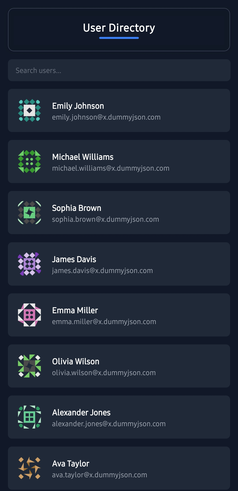
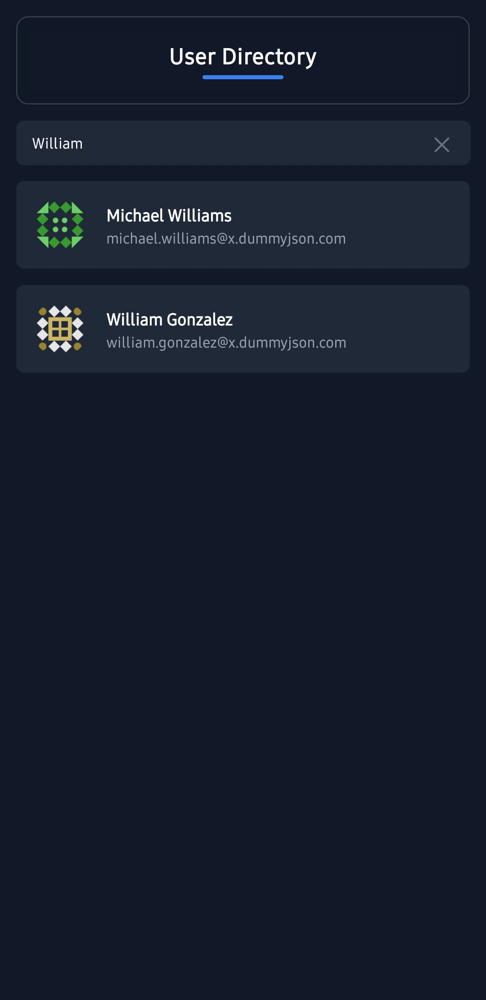
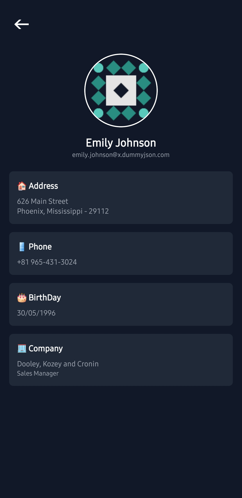

# User Directory App

A modern and efficient User Directory app built using React Native and Expo. The app features a sleek dark theme UI, infinite scrolling, user search functionality, and detailed user profiles. 

---

## Features

- **User List with Infinite Scrolling**: Fetches user data dynamically using the [dummyJSON API](https://dummyjson.com/users), ensuring smooth performance with on-demand data loading.
- **Search Functionality**: Allows users to search by name or email, powered by real-time API filtering.
- **Detailed User Profiles**: Each user has a dedicated page displaying information such as:
  - Name
  - Email
  - Address
  - Phone Number
  - Company
- **Dark and Modern UI**: Built with intuitive design for a smooth, user-friendly experience.

### Why dummyJSON API?
I switched to `dummyJSON` instead of `jsonplaceholder` due to its extended dataset, which supports more advanced features.

---

## Screenshots


-

-


---

## Challenges Faced

1. **Search Functionality**: 
   - Tweaking API calls to ensure efficient filtering based on search input (name or email).
2. **Smooth Performance**:
   - Implementing infinite scrolling without lag using optimized state management and Expo features.

---

## Technologies & Libraries

- **React Native**: Core framework for building the app.
- **Expo**: Facilitates rapid development with tools and APIs.
- **Axios**: For seamless API requests.
- **React Navigation**: To manage app navigation (stack, tab, and nested navigators).
- **FlatList**: Efficiently renders the infinite scrolling list.
- **React Native Reanimated**: Enhances animations and interactions.
- **Expo Image**: For image loading and caching.

---

## How to Run the App

### Prerequisites
- [Node.js](https://nodejs.org/) installed on your machine.
- Expo CLI installed globally. (`npm install -g expo-cli`)

### Installation

1. Clone the repository:
   ```bash
   https://github.com/Anmol-Awasthi/User-Directory.git
   ```

2. Install dependencies:
   ```bash
   npm install
   ```

3. Start the Expo development server:
   ```bash
   npx expo start
   ```
   
   or

   ```bash
   expo start 
   ```

4. Run the app on your device:
   - Use the Expo Go app (available on iOS and Android) to scan the QR code.
   - Or use an emulator/simulator.
